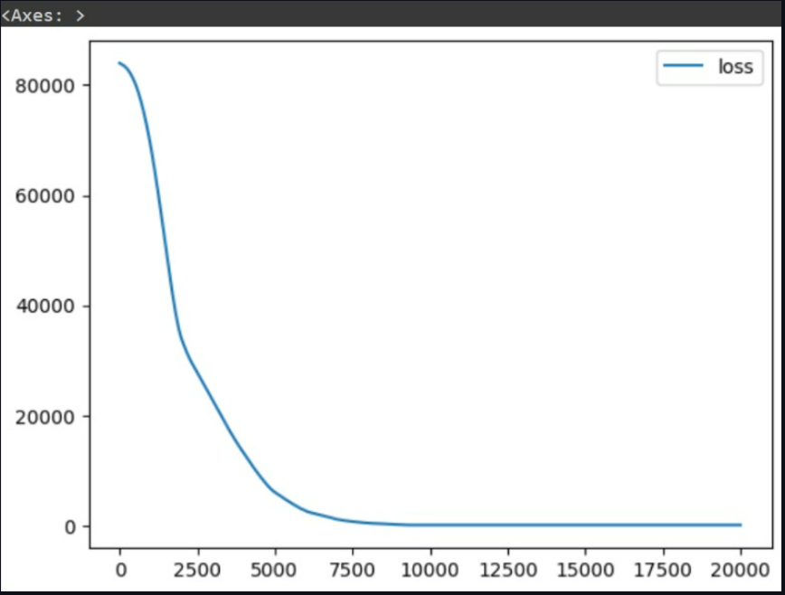

# Developing a Neural Network Regression Model

## AIM

To develop a neural network regression model for the given dataset.

## THEORY

Explain the problem statement

## Neural Network Model

Include the neural network model diagram.

## DESIGN STEPS

### STEP 1:

Loading the dataset

### STEP 2:

Split the dataset into training and testing

### STEP 3:

Create MinMaxScalar objects ,fit the model and transform the data.

### STEP 4:

Build the Neural Network Model and compile the model.

### STEP 5:

Train the model with the training data.

### STEP 6:

Plot the performance plot

### STEP 7:

Evaluate the model with the testing data.

## PROGRAM
### Importing Required Packages :
~~~

import pandas as pd
from sklearn.model_selection import train_test_split
from sklearn.preprocessing import MinMaxScaler
from tensorflow.keras.models import Sequential
from tensorflow.keras.layers import Dense
from google.colab import auth
~~~

### Authentication and Creating DataFrame From DataSheet:
~~~
import gspread
from google.auth import default
auth.authenticate_user()
creds, _ = default()
gc = gspread.authorize(creds)
worksheet = gc.open('dl').sheet1
data = worksheet.get_all_values()
dataset = pd.DataFrame(data[1:], columns=data[0])
dataset = dataset.astype({'Input':'float'})
dataset = dataset.astype({'Output':'float'})
dataset.head()
~~~
### Assigning X and Y values :
~~~
X = dataset[['Input']].values
Y = dataset[['Output']].values
~~~
### Normalizing the data :
~~~
x_train,x_test,y_train,y_test = train_test_split(X,Y,test_size = 0.33,random_state = 20)
Scaler = MinMaxScaler()
Scaler.fit(x_train)
x_train_scale = Scaler.transform(x_train)
~~~
### Creating and Training the model :
~~~
my_brain = Sequential([
    Dense(units = 4, activation = 'relu' , input_shape=[1]),
    Dense(units = 6),
    Dense(units = 1)

])
my_brain.compile(optimizer='rmsprop',loss='mse')
my_brain.fit(x=x_train_scale,y=y_train,epochs=20000)
~~~
### Plot the loss :
~~~

loss_df = pd.DataFrame(my_brain.history.history)
loss_df.plot()
Evaluate the Model :

x_test1 = Scaler.transform(x_test)
my_brain.evaluate(x_test1,y_test)
~~~
### Prediction for a value :
~~~
X_n1 = [[30]]
input_scaled = Scaler.transform(X_n1)
my_brain.predict(input_scaled)
~~~

 ### Dataset information:

## OUTPUT

### Training Loss Vs Iteration Plot

### Test Data Root Mean Squared Error

### New Sample Data Prediction

## RESULT
Therefore We successfully developed a neural network regression model for the given dataset.
